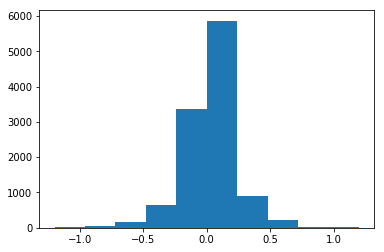
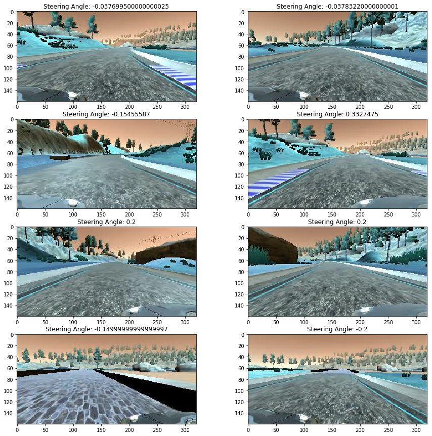
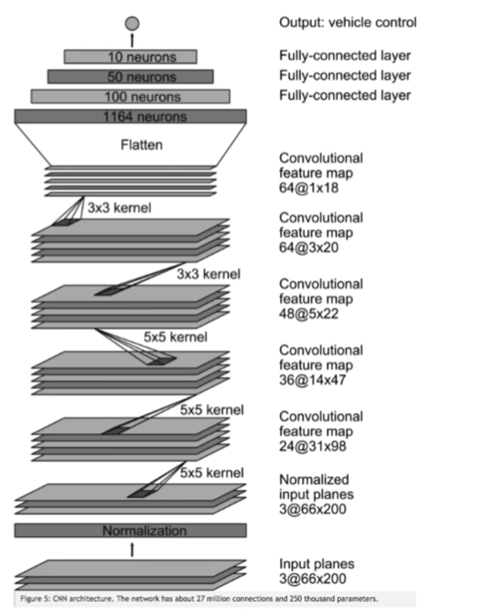

# Udacity Self-Driving Car Nanodegree, Behavioural Cloning Project (Project 3)

## Introduction:

*The objective of this project is to train a model to drive a car autonomously on a simulated track based on the behaviour of a human driver.
Training data is gotten from examples of a human driving in the simulator, then fed into a deep learning network which learns the response (steering angle) for every encountered frame in the simulation. In other words, the model is trained to predict an appropriate steering angle for every frame while driving. The model is then validated on a new track to check for generalization of the learned features for performing steering angle prediction.*

This project is influenced by [nvidia paper](https://images.nvidia.com/content/tegra/automotive/images/2016/solutions/pdf/end-to-end-dl-using-px.pdf) and [comma.ai paper](https://arxiv.org/pdf/1608.01230v1.pdf).

## Outline

**1. Data Recording**

**2. Data Processing**

**3. Model Training**

**4. Model Testing**

**5. Conclusion**

## 1. Data Recording

The simulator has two modes - Training mode and Autonomous mode. Training mode is used to collect training data by driving through the tracks and recording the driving data in a folder. 
Udacity provided a set of training data which can be downloaded, but I had recorded my own training data.

## 2. Data processing

Data processing is done to allow our model to be able to easily work with raw data for training. In this project, the data processing is built into a generator (keras *fit_generator*) to allow for real-time processing of the data. The advantage here is that, in the case that we are working with a very large amount of data, the whole dataset is not loaded into memory, we can therefore work with a manageable batch of data at a time. Hence the generator is run in parallel to the model, for efficiency.

The following are the processing steps carried on the data:

1. **To choose center, left and right  camera images:** The simulator provides three camera views namely; center, left and right views. Since we are required to use only one camera view, we choose randomly from the three views. While using the left and right images, we add and subtract 0.2 to the steering angles respectively to make up for the camera offsets.

2. **To flip image:** In other to balance left and right images, we randomly flip images and change sign on the steering angles. The following figure shows the view from the left, right and center cameras after been jittered, cropped, and angles corrected. The right camera view has been flipped so it looks like a left camera image.

And as a usual practice, the images were normalized before they were used by th model to be trained.

Plotting a histogram for the steering angles recorded.

Sample Images after processing along with their respective steering angles is shown below

## 3. Model Training

The [Nvidia model][1] was adopted for training, because it gave better result after experimenting with other kinds of model (e.g. comma.ai). The network consists of 9 layers, including a normalization layer, 5 convolutional layers and 3 fully connected layers. This network architecture is shown below.

Convolutions was used in the first three layers with 2x2 strides and a 5x5 kernel, and non-strided convolution with 3x3 kernel size in the last two convolutional layers. The convolutional layers were followed by three fully connected layers which then outputs the steering angle.
    _________________________________________________________________
    Layer (type)                 Output Shape              Param #   
    =================================================================
    conv2d_3 (Conv2D)            (None, 38, 78, 24)        1824      
    _________________________________________________________________
    dropout_2 (Dropout)          (None, 38, 78, 24)        0         
    _________________________________________________________________
    conv2d_4 (Conv2D)            (None, 17, 37, 36)        21636     
    _________________________________________________________________
    conv2d_5 (Conv2D)            (None, 7, 17, 48)         43248     
    _________________________________________________________________
    dropout_3 (Dropout)          (None, 7, 17, 48)         0         
    _________________________________________________________________
    conv2d_6 (Conv2D)            (None, 5, 15, 64)         27712     
    _________________________________________________________________
    conv2d_7 (Conv2D)            (None, 3, 13, 64)         36928     
    _________________________________________________________________
    dropout_4 (Dropout)          (None, 3, 13, 64)         0         
    _________________________________________________________________
    flatten_1 (Flatten)          (None, 2496)              0         
    _________________________________________________________________
    dense_1 (Dense)              (None, 1164)              2906508   
    _________________________________________________________________
    dropout_5 (Dropout)          (None, 1164)              0         
    _________________________________________________________________
    dense_2 (Dense)              (None, 100)               116500    
    _________________________________________________________________
    dense_3 (Dense)              (None, 50)                5050      
    _________________________________________________________________
    dropout_6 (Dropout)          (None, 50)                0         
    _________________________________________________________________
    dense_4 (Dense)              (None, 10)                510       
    _________________________________________________________________
    dense_5 (Dense)              (None, 1)                 11        
    =================================================================

Overfitting was reduced by using aggressive Dropout (0.25) on many of the layers and this turned out to be a good practice, and also subsampling of size (2,2) is used to reduce the complexity of the model. The original NVIDIA architecture contains about 60 million parameters whereas this reduced model contains only 3.1 million parameters. This greatly reduces the training times at the same time the accuracy is also high.

    Total params: 3,159,927
    Trainable params: 3,159,927
    Non-trainable params: 0
    _________________________________________________________________

An Adam optimizer was used for optimization. This requires little or no tunning as the learning rate is adaptive. 
and for activation 'relu' was used.

## 4. Model Testing

The trained model was tested on the first track. This gave a good result, as the car could drive on the track smoothly. The test video can be found in the attachment.

## 5. Conclusion

A deep learning model to drive autonomously on a simulated track was trained by using a human behaviour-sampled data. Though this model only controls the steering angle, it can also be extended to control throttle and brake.

[1]: https://arxiv.org/pdf/1604.07316v1.pdf "End to End Learning for Self-Driving Cars"

